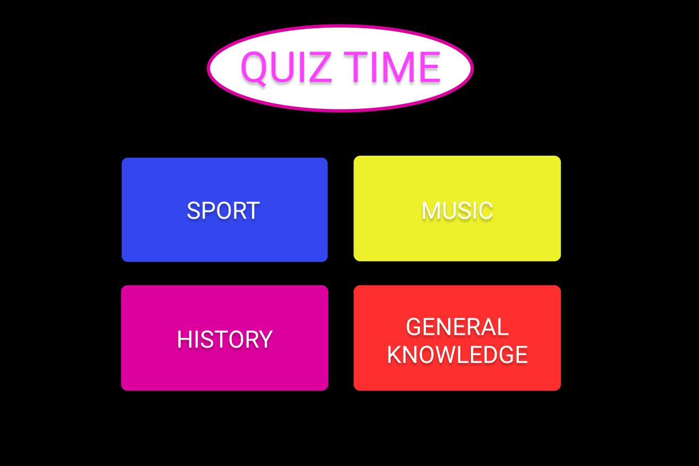
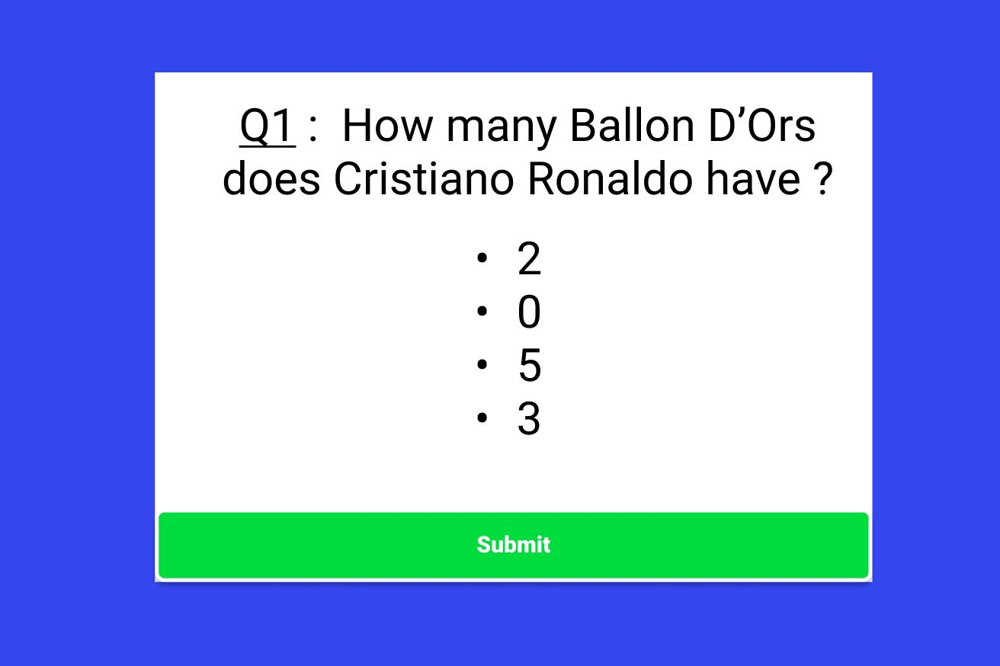
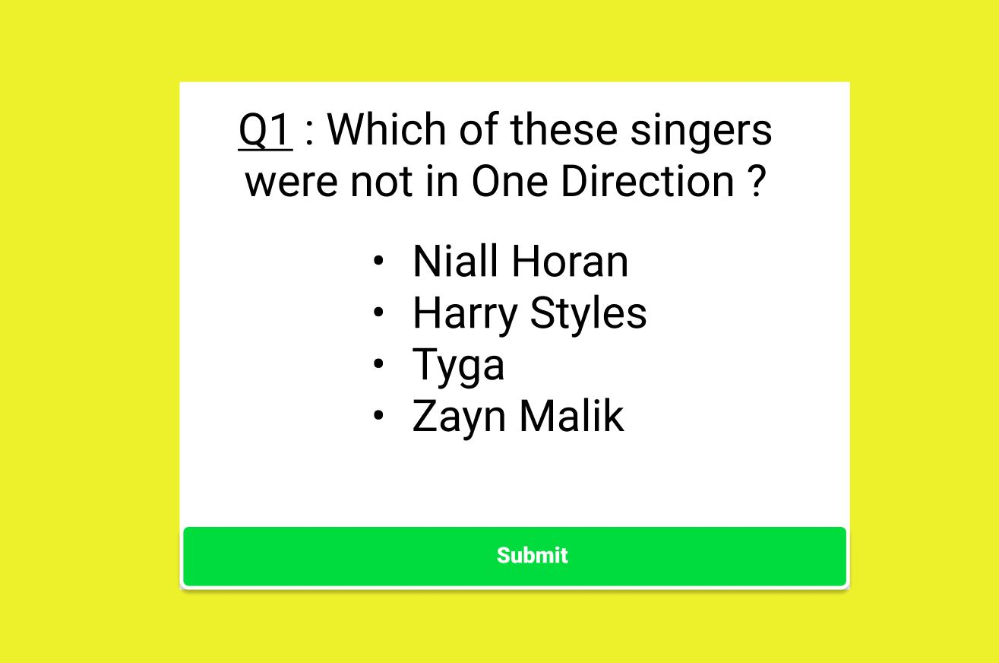
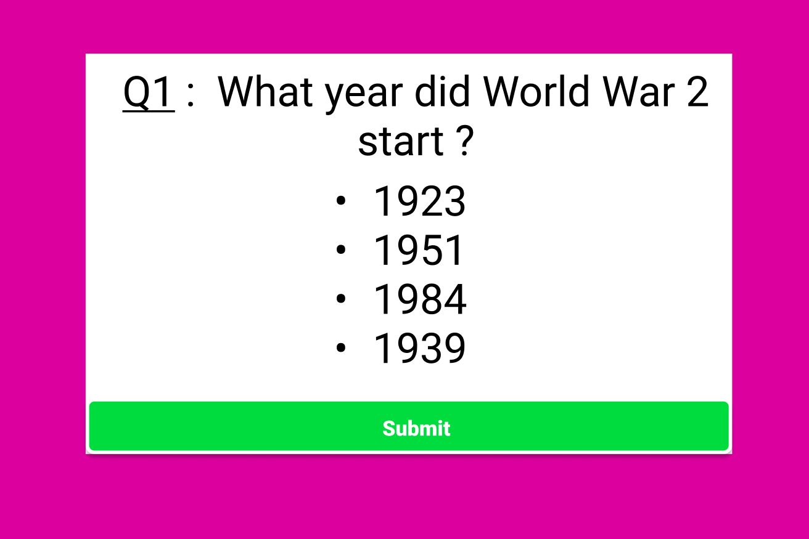
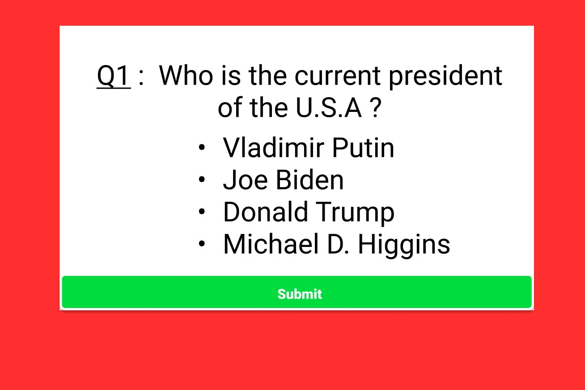
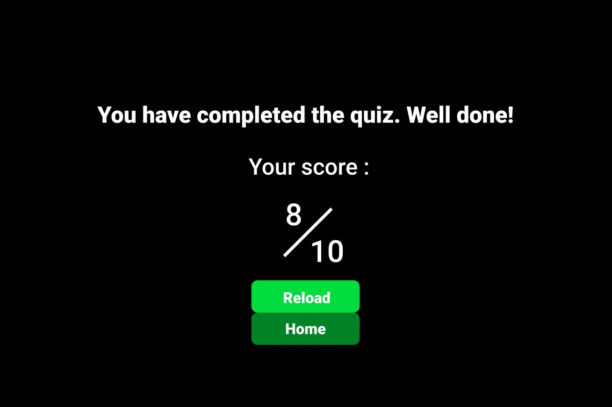
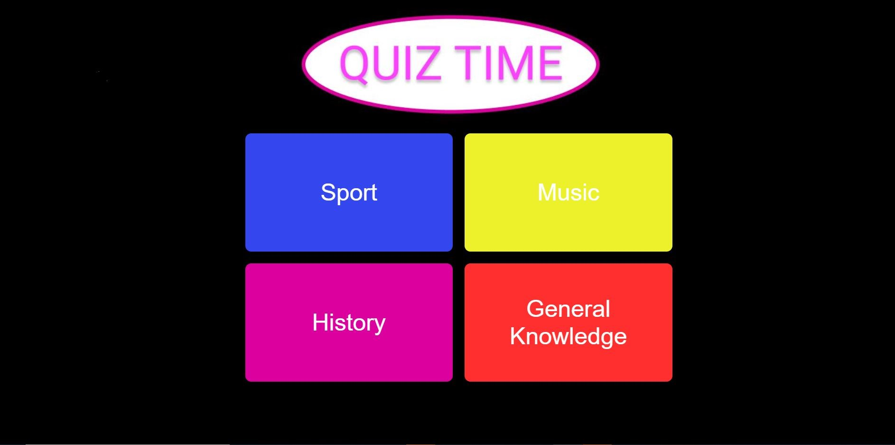
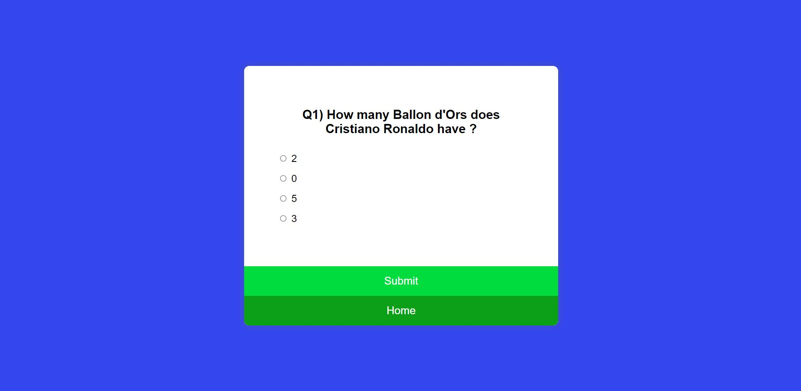
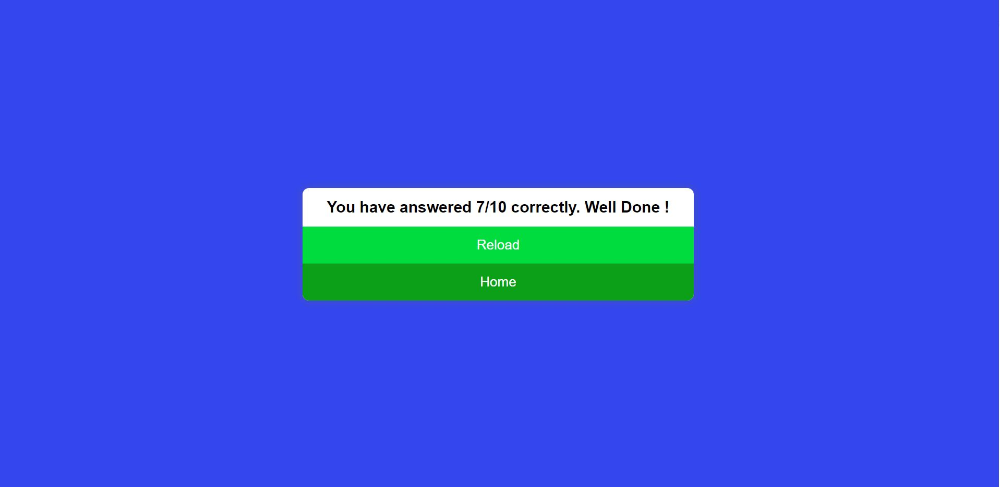

# Quiz Time

Quiz Time is an application that quizzes the user on different topics. The main goal of this project is for the application to be user friendly and an enjoyable experience for the user.

## Description

Quiz Time is an application that has 4 categories of topics the user can choose from. These include, sport, music, history and general knowledge. Each quiz differentiates by having their own unique color scheme. Upon choosing a topic, the user will be presented with 10 questions, (the same number for each topic) and will have 4 options to choose an answer, one of them being the correct answer. When the user has completed the quiz, their score will be presented and they will have an option to play again, or choose a different topic. I used HTML, CSS and Javascript to build this application. I tried to apply my learning in HTML, CSS and Javascript from the course to showcase as much functionality as I could. I didn't have much difficulty, apart from trying to calculate the users final score which was challenging. Overall I found developing this application both enjoyable and rewarding.

## How to use the project

On the Home page, you will be presented with 4 buttons in a grid-layout. You can then select the preferred topic you would like to be quizzed on. After selecting a topic, you will be presented with the first question. You will have 4 options of answers to choose from and are only able to select one. After selecting your desired answer, you will press the "Submit" button. This will then bring you onto the second question. If you have not selected an answer, the application will not allow the user carry on until one is selected. When finish the quiz, your score will be revealed. You will then have an option to reload the quiz via a "Reload" button, or to navigate back to the Home page to choose a different topic via a "Home" button.

## Wireframes 

### Home Page Wireframe

### Sports Wireframe

### Music Wireframe

### History Wireframe

### General Knowledge Wireframe

### Quiz Complete Wireframe

 

## Website Screenshots

### Home Page 
 

### Quiz in Progress

### Quiz Completed

